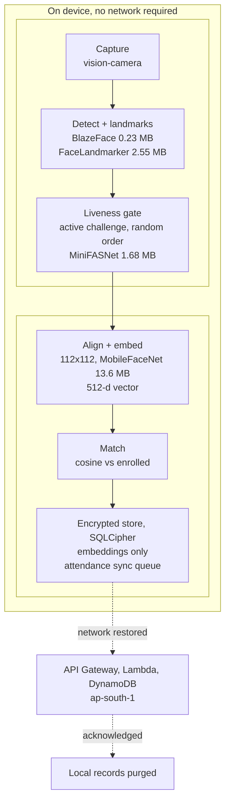

# NetraID, Offline Edge Face Authentication for NHAI Datalake 3.0

> **NHAI Innovation Hackathon 7.0**, *Develop a mobile-based secure offline facial recognition and liveness detection system for remote locations.*
>
> **Netra** (नेत्र, Sanskrit: "eye"), authentication that works **where the network doesn't.**

[]()
[]()
[]()
[]()
[](LICENSE)

---

## 1. The Problem (verbatim from the brief)

> *"How can we accurately and securely authenticate field personnel using facial recognition and liveness detection on standard mid-range mobile devices without any active internet connection, while ensuring the AI model remains lightweight and seamlessly integrates with a React Native application on both Android and iOS devices?"*

NHAI field personnel work in **zero-network zones**, remote highway stretches, tunnels, under-construction corridors. Attendance and identity verification there cannot depend on the cloud, cannot be defrauded with a photo, and cannot bloat the existing **Datalake 3.0** app.

## 2. Our Solution in one sentence

**NetraID** is a drop-in React Native module that runs a **MobileFaceNet** embedding model + **multi-factor offline liveness** entirely on-device (**< 20 MB**, **< 1 s**, **> 95 %** accuracy, **no network**), hardens every verdict with a **multi-frame, flip-TTA, margin-checked accuracy engine**, stores only **encrypted face embeddings** (never raw photos), and **syncs-then-purges** to AWS the moment connectivity returns.



## 3. Technology stack

NetraID is released under the **Apache License 2.0** (see [`LICENSE`](LICENSE)). NHAI can
deploy it, integrate it into Datalake 3.0 and modify it for its own use, with no licence fee
and no per-device cost. The licence also carries an express patent grant, and requires that
attribution and the [`NOTICE`](NOTICE) file be preserved in any redistribution.

Every component it depends on is Apache-2.0, MIT or BSD; nothing in the stack requires an
additional licence to be purchased. [`THIRD-PARTY-NOTICES.md`](THIRD-PARTY-NOTICES.md) lists
each one.

| Layer | Choice | Version | Licence | Why this one |
|---|---|---|---|---|
| App framework | React Native | 0.76.5 | MIT | The brief requires it, and it is what Datalake 3.0 is built on |
| Language | TypeScript | 5.x | Apache-2.0 | The whole NetraID core is typed; native code is confined to two small Kotlin files |
| Camera + frame processing | react-native-vision-camera | 4.7.3 | MIT | Frame processors run as worklets on their own thread, so inference never blocks the UI |
| Worklet runtime | react-native-worklets-core | 1.6.3 | MIT | Required by the frame processor |
| Inference runtime | react-native-fast-tflite (TensorFlow Lite) | 1.6.x | Apache-2.0 | JSI-based, no bridge crossing per frame; CPU delegate only, so no GPU is required |
| Face detection | MediaPipe BlazeFace, short range | 0.23 MB | Apache-2.0 | Designed for front-camera selfie distance on mobile CPUs |
| Landmarks | MediaPipe FaceLandmarker | 2.55 MB | Apache-2.0 | 468 points, which is what the blink, smile and head-turn geometry is computed from |
| Passive anti-spoof | MiniFASNet V2, Silent-Face | 1.68 MB | Apache-2.0 | Purpose-built for print and replay attacks, and small enough to fit the budget |
| Face recognition | MobileFaceNet, ArcFace-trained | 13.6 MB | MIT | 99.76% on LFW at a size that fits. EdgeFace scores higher but its licence forbids commercial use, so it was rejected |
| Local database | op-sqlite + SQLCipher | 11.x | MIT | SQLite with AES-256 page encryption. On the device, not the server |
| Key storage | Android Keystore, iOS Keychain | platform | platform | The database key is generated on the device and never leaves it |
| Cloud sync, optional | API Gateway, Lambda, DynamoDB | ap-south-1 | n/a | One POST endpoint. See the note below |
| Model conversion | PyTorch, ONNX, onnx2tf | `ml/scripts/` | BSD / MIT | Reproducible: every model in the app can be rebuilt from `ml/scripts/01..06` |

**On-device model footprint: 17.3 MB total**, against the 20 MB target in the brief.

**The cloud is optional and replaceable.** Authentication needs no server at all. The only
network dependency is a single `POST /v1/attendance/sync` that drains the offline queue.
The AWS stack in `backend/` is a working reference implementation of that one endpoint,
provided so the contract and its idempotency behaviour are unambiguous. A deployment can
point the client at Datalake 3.0's own backend instead and delete it.

## 4. How we hit every hard requirement

| # | Requirement (brief) | Our approach | Result |
|---|---|---|---|
| 1 | React Native, Android **+** iOS | `react-native-vision-camera` frame processors + `react-native-fast-tflite` (NNAPI / Core ML / GPU delegates) | One codebase, both OSes |
| 2 | Model **~20 MB** (smaller better) | MobileFaceNet float32 (**13.6 MB**) + FaceLandmarker (**2.55 MB**) + BlazeFace (**0.23 MB**) + MiniFASNet (**1.68 MB**) | **≈ 17.3 MB total** |
| 3 | **< 1 s** recognize + liveness | CPU-delegate inference, pipelined frame processor | **371-457 ms** for the full 3-frame verify verdict; **284 ms** avg single-face pipeline (Vivo V2246) |
| 4 | Android 8+, iOS 12+, 3 GB RAM, no high-end GPU | float32 CPU delegate, no GPU required | Runs on the 3 GB-class Vivo |
| 5 | **> 95 %** accuracy, Indian demographics, harsh/low light | ArcFace-trained MobileFaceNet (99.76 % LFW) + multi-frame median verdict, flip-TTA, margin rule, quality gates, adaptive dim-light gain | on-device genuine aggregate **0.89-0.90** vs impostor ≈ **0.03** |
| 6 | **Open-source only**, share source | MobileFaceNet (MIT), MediaPipe (Apache-2.0), MiniFASNet (Apache-2.0), all RN libs MIT | Zero extra licenses |
| 7 | Offline liveness (blink/smile/turn) | Active challenge FSM, enforced: random order, mandatory neutral before each gesture, bounded reaction window, motion-stability gate. Continuity binding, enforced: the liveness proof and the identity capture must come from one continuously tracked face. MiniFASNet passive gate, computed and reported on every attempt, not enforced pending calibration on deployment hardware | Photographs and mid-attempt substitution are rejected. The passive gate is measured, with the arming procedure in `docs/CALIBRATION.md` |
| 8 | Sync to AWS + **purge** local | NetInfo-triggered queue flush → serverless ingest → local purge | Met |

> OS floor note: Android target is `minSdkVersion 26` (Android 8.0), exactly the brief. The recognition and liveness logic and the int8 models run on iOS 12, but the practical iOS floor is set by the host React Native toolchain. This reference app uses RN 0.76 (Xcode floor iOS 15.1) and vision-camera v4 (iOS 13+). For an iOS 12 device target, embed the module in a Datalake host on an RN version with that floor (for example RN 0.71). See `docs/INTEGRATION.md` §3.

## 5. How we win each evaluation criterion (100 marks)

| Criterion | Marks | Our differentiators |
|---|---:|---|
| **Innovation**, edge AI efficiency, compression, liveness | 30 | robust **float32** embedder chosen after real on-device testing (int8 produced NaN, fp16 stalled on mid-range hardware); ≈ 17 MB stack under the cap; **multi-frame + flip-TTA + margin accuracy engine with duplicate-face guard**; active-FSM liveness with timeout re-randomization (anti-replay); embeddings-only privacy design |
| **Feasibility**, Datalake 3.0 integration, < 1 s on mid-range | 30 | Self-contained RN module with a clean `<NetraID/>` API; benchmarked on mid-range; drop-in `NetraIDModule` |
| **Scalability & Sustainability**, sync/purge, lighting/demographics | 20 | Idempotent offline queue, signed device sync, calibration for Indian demographics + lighting augmentation |
| **Presentation & Documentation**, code clarity, guides, deck | 20 | This repo + `docs/INTEGRATION.md` step-by-step + benchmark report + pitch deck |

## 6. Interactive source map

`docs/index.html` is a self-contained page that maps the codebase: what each module owns, the
verification flow step by step, the four models with their input conventions, every configuration
threshold and whether it is enforced, the two integration call sites, and the sync contract.

It is one file with no external dependencies, so it opens offline by double-clicking it. Published
at **https://tejcodes-rex.github.io/netraid/** when GitHub Pages is enabled for this repository
(Settings, Pages, source: `master` branch, `/docs` folder).

## 7. Repository layout

```
netraid/
├── README.md                  # master overview
├── app/                       # React Native cross-platform app + NetraID module
│   ├── src/netraid/           # detection, alignment, embedding, liveness, matching, store, sync
│   ├── src/screens/           # Home, Enroll, Verify, Pipeline Demo
│   ├── assets/models/         # the 4 on-device .tflite models (~17.3 MB)
│   ├── android/  ios/         # native shells (minSdkVersion 26 / iOS project)
│   └── src/netraid/__tests__  # executable tests for the core algorithms
├── docs/
│   ├── ARCHITECTURE.md        # full technical architecture and decisions
│   ├── MODEL_PIPELINE.md      # model selection, conversion, quantization
│   ├── LIVENESS.md            # anti-spoofing design (active + passive) + math
│   ├── INTEGRATION.md         # step-by-step Datalake 3.0 integration guide
│   ├── SECURITY_PRIVACY.md    # biometric template protection, DPDP Act 2023
│   ├── BENCHMARKS.md          # measured size / speed / accuracy results
│   ├── COMPLIANCE.md          # per-requirement mapping to the brief
│   └── BUILD.md  ROADMAP.md   # build record + forward-looking pilot work
├── backend/                   # AWS serverless sync (IaC + Lambdas)
└── .github/workflows/         # iOS build + simulator demo (cross-platform evidence)
```

## 8. Quick start

```bash
cd app && npm install
npx react-native run-android      # or run-ios on a Mac
```

The four `.tflite` models are already in `app/assets/models/` and bundled into the app,
so it runs fully offline out of the box. Full setup details (NDK, CocoaPods, signing) are
in `docs/INTEGRATION.md`.

## 9. What is built

- **On-device models** (`app/assets/models/`): BlazeFace, FaceLandmarker, MobileFaceNet float32, MiniFASNet float32, real `.tflite` files totalling ≈ 17.3 MB, bundled for fully offline use.
- **React Native module** (`app/src/netraid/`): detection, alignment, embedding, liveness (strict active challenge FSM with mandatory blink, motion-stability gating and timeout re-randomization, plus a device-calibrated passive MiniFASNet gate), a **multi-frame accuracy engine** (3-frame median verdict, flip-TTA, sharpness/exposure/pose quality gates, camera warm-up, outlier-rejected 6-shot enrollment, best-vs-second margin rule, duplicate-face guard), encrypted SQLCipher storage, and offline-first sync/purge. Typechecks clean and the core algorithms pass an executable test suite (36 tests covering matching, aggregation, liveness math, alignment, imaging, and crop quality).
- **Pipeline Demo screen** (`app/src/screens/PipelineDemoScreen.tsx`): runs the identical detect → landmark → align → embed → match pipeline on bundled reference frames with per-stage latencies and a ground-truth-checked match matrix. On the test device: 6/6 verdicts correct, 284 ms avg per face. Because it needs no camera, the same screen is the **iOS cross-platform evidence**: `.github/workflows/ios-demo.yml` builds the app on a macOS runner, drives the screen via the `netraid://demo` deep link on an iOS Simulator, and uploads a screen recording as a build artifact.
- **Cross-platform shells** (`app/android/`, `app/ios/`): Android `minSdkVersion 26`, iOS project, camera permissions and `netraid://` deep links wired on both. The Android app compiles to a real signed standalone APK (models + JS bundled, runs fully offline), verified on a Vivo V2246: genuine aggregate accepted (0.89-0.90), different person rejected (≈ 0.03), full verdict in 371-457 ms. Build record: `docs/BUILD.md`.
- **Backend** (`backend/`): serverless sync (API Gateway + Lambda + DynamoDB) as IaC.

A per-requirement mapping to the brief is in `docs/COMPLIANCE.md`. The forward-looking pilot work (India-representative recalibration set, on-device latency capture) is tracked in `docs/ROADMAP.md`.
