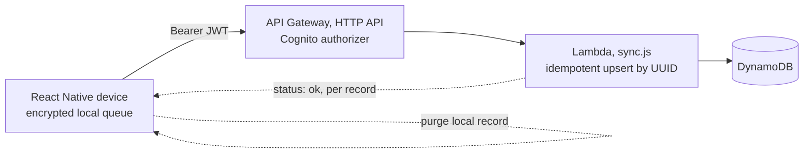

# NetraID Backend, Offline Attendance Sync

Minimal, serverless, India-region backend that receives attendance events the
device captured **offline** and stored encrypted, then lets the device purge them.



## Why it's safe to purge
Every record carries a **client-generated UUID**. The Lambda writes with
`ConditionExpression: attribute_not_exists(id)`, so:
- first send → stored, returns `ok`
- duplicate send (after a flaky ACK) → conditional fail, still returns `ok`

Re-sends are therefore no-ops. The device only purges rows the server confirmed
`ok`, so an event can never be lost *or* duplicated.

## Data model (single table)
| Item | pk | sk | GSI1 (by site) |
|---|---|---|---|
| Attendance | `PERSON#<id>` | `TS#<ts>#<uuid>` | `SITE#<siteId>` / `TS#<ts>` |

Encryption at rest (SSE), point-in-time recovery, Graviton/arm64 Lambda.

## Deploy
```bash
cd backend/lambdas && npm install && cd ../infra
sam build
sam deploy --guided --region ap-south-1 \
  --parameter-overrides CognitoUserPoolArn=<your-pool-arn>
```
Then set `NETRAID_API_BASE` in the app to the `ApiUrl` output.

## Endpoints
| Method | Path | Auth | Body |
|---|---|---|---|
| POST | `/v1/attendance/sync` | Cognito JWT | `{ records: [...] }` → `{ results: [{id,status}] }` |

> Data residency: all resources deploy to **ap-south-1 (Mumbai)** to keep
> biometric-derived data in India (DPDP Act 2023 alignment, see
> `docs/SECURITY_PRIVACY.md`). Note we sync attendance *events* and embeddings
> metadata, **never raw face images**.
