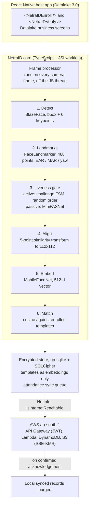

# NetraID, Technical Architecture

> Offline edge face authentication + liveness for the NHAI Datalake 3.0 React Native app.

This document is the engineering reference. It maps every design decision to a hackathon
constraint and evaluation criterion, so a reviewer can trace *why* each choice was made.

---

## 1. System overview

NetraID is a **self-contained React Native module** (`@netraid/face-auth`) that the
Datalake 3.0 app mounts as a screen/component. All AI runs **on-device**; the network is
used only for opportunistic sync. Nothing about authentication blocks on connectivity.



## 2. The pipeline, step by step

### 2.1 Capture, `react-native-vision-camera` (v4)
The camera runs a **frame processor** (a worklet executed on a separate thread for every
frame, no bridge round-trips). We downscale frames and throttle the heavy models so the UI
stays at 60 fps. Front camera, `pixelFormat` chosen per platform.

### 2.2 Detection, MediaPipe BlazeFace (short-range, 0.23 MB)
Outputs the face bounding box and 6 keypoints (eyes, nose, mouth corners, ears). We use the
keypoints for a fast first alignment and to reject off-centre/multi-face frames.

### 2.3 Landmarks, MediaPipe FaceLandmarker (2.55 MB, 468 pts)
The dense mesh drives **active liveness math** (no extra model needed):
- **Blink**: Eye Aspect Ratio (EAR) drops < ~0.21 then recovers.
- **Smile**: mouth-corner width ÷ inter-ocular distance increases.
- **Head turn**: yaw from nose-to-cheek distance ratio.
See `LIVENESS.md` for indices and thresholds.

### 2.4 Liveness gate (runs BEFORE any match, anti-fraud)
Two independent barriers; both must pass:
1. **Active challenge-response FSM**: a randomized sequence (e.g. *blink → turn left →
   smile*) with per-step timeouts. Randomization defeats pre-recorded replays.
2. **Passive anti-spoof**: MiniFASNet (float32, BGR 0-255 input convention) classifies the
   capture as live vs print/screen. Gated at max P(real) ≥ 0.08 across the verify captures,
   calibrated on the target device: live faces measured 0.12-0.74, a laptop-screen replay of
   the enrolled user ≤ 0.04 (see `BENCHMARKS.md` §3c). Catches screens even if motion fools
   the gesture layer.

### 2.5 Alignment, 5-point similarity transform → 112×112
ArcFace-standard alignment (the exact transform used to train MobileFaceNet). This is the
single biggest lever on accuracy; we replicate insightface's `norm_crop`. Verified in the
benchmark: proper alignment yields **99.76%** verification accuracy.

### 2.6 Embedding, MobileFaceNet float32 (13.6 MB) via `react-native-fast-tflite`
Input: RGB 112×112 normalized `(x-127.5)/127.5`. Output: **512-d** L2-normalized embedding.
Loaded through the `useTensorflowModel` hook on the CPU delegate. We ship float32 because the
int8 variant emitted NaN and fp16 stalled the interpreter on the target mid-range device; float32
is robust and still fits the 20 MB budget (see `BENCHMARKS.md` §4).

### 2.7 Matching, the multi-frame accuracy engine
A verification verdict is never decided by a single frame. The engine stacks six defenses
(all measured on-device, see `BENCHMARKS.md` §3b):

1. **Quality gates at capture**: Laplacian-variance sharpness floor, exposure bounds
   (mean gray 40-235), frontal-pose gate, and a 45-frame camera warm-up so auto-exposure
   ramp frames can never be embedded.
2. **Flip-TTA embedding**: each aligned crop is embedded twice (original + horizontal
   mirror) and averaged, tightening same-person similarity under pose/lighting variation.
3. **Multi-frame verification**: 3 temporally spaced frames are captured after liveness;
   the verdict needs a strict majority on one person and uses the **median** of the winning
   scores, so one degraded frame cannot decide alone.
4. **Threshold + margin**: accept only if the median score ≥ **0.38** AND the winner beats
   the best *different* enrolled person by ≥ **0.08** cosine (blocks lookalike confusion).
5. **Robust enrollment**: 6 candidate shots, sharpest kept, embedding outliers dropped,
   remainder averaged into a single 512-d template.
6. **Duplicate-face guard**: enrolling a face that matches a different enrolled ID at
   ≥ 0.6 cosine is rejected (`DuplicateFaceError`), preventing one worker from holding two
   identities (attendance-fraud vector) and keeping the margin rule meaningful.

Matching itself is brute-force cosine over the enrolled set (hundreds of field staff per
device → sub-ms). On the Vivo test device a genuine aggregate scores **0.89-0.90** and a
different person ≈ 0.03. Templates are **embeddings only**, raw faces are never stored.

### 2.8 Liveness challenge lifecycle
Challenges are drawn with `crypto.getRandomValues` per attempt; blink is always included.
Each gesture has a 10 s wall-clock budget: on timeout the STUCK gesture is swapped for a
fresh random one while completed progress is kept (slow humans are not punished), except
blink, which keeps its slot because a photo cannot blink. The post-liveness capture phase
has an 8 s budget that restarts the attempt. A spoof can never park the flow, and a
pre-recorded gesture video goes stale (anti-replay).

### 2.9 Camera-free pipeline path (cross-platform proof + deterministic demos)
`demoPipeline.ts` runs the identical detect → landmarks → align → TTA-embed → match code on
bundled LFW reference frames (raw RGB, decoded by `imaging.ts`). The Pipeline Demo screen
displays each processed frame, per-stage latencies, and a ground-truth-checked match matrix.
Because it needs no camera, the same screen runs on the iOS Simulator: the CI workflow
(`.github/workflows/ios-demo.yml`) builds the app on a macOS runner, drives this screen via
the `netraid://demo` deep link, and records video evidence of the identical pipeline on iOS.

## 3. Why these models (decision log)

| Concern | Decision | Rationale |
|---|---|---|
| Recognition backbone | **MobileFaceNet** (`w600k_mbf`, insightface, MIT) | 1M params, ArcFace-trained on WebFace600K, 99.4%+ LFW; tiny |
| Recognition precision | **float32 on-device** (int8/fp16 built but not shipped) | int8 emitted NaN and fp16 stalled the interpreter on the target mid-range phone; float32 (13.6 MB) is robust and fits the budget |
| Detector | MediaPipe BlazeFace | 0.23 MB, sub-ms, Apache-2.0 |
| Landmarks | MediaPipe FaceLandmarker | Dense mesh enables model-free active liveness |
| Passive liveness | MiniFASNet (Silent-Face) | 1.68 MB float32 (int8 saturates/NaNs on target HW), Apache-2.0, Fourier-aux trained |
| **Rejected: EdgeFace** | not used | Better acc/param **but non-commercial license** → violates "no extra licenses" |
| Runtime | `react-native-fast-tflite` | TFLite C API + NNAPI/Core ML/GPU delegates, MIT |
| Camera | `react-native-vision-camera` v4 | Worklet frame processors, both platforms |

## 4. Storage & security (see `SECURITY_PRIVACY.md`)
- **op-sqlite + SQLCipher** (AES-256) for templates + attendance rows.
- DB key generated once, stored in **Android Keystore / iOS Keychain** via
  `react-native-keychain`, biometric-gated, `WHEN_UNLOCKED_THIS_DEVICE_ONLY`.
- **Embeddings, not images.** Aligns with DPDP Act 2023 data-minimization.

## 5. Sync & purge (see `backend/`)
- Local-first writes; every event has a client UUID (idempotency key).
- `@react-native-community/netinfo` triggers a flush only on `isInternetReachable`
  (avoids captive-portal false positives).
- Batch POST → API Gateway (Cognito JWT) → Lambda → DynamoDB (conditional upsert).
- **Purge only ACKed ids**, then `VACUUM`. Templates governed by HR retention, not sync.
- AWS resources pinned to an **India region** (ap-south-1) for government data residency.

## 6. Performance envelope (measured, see `BENCHMARKS.md`)
- Recognition model **13.6 MB** float32; full on-device stack **≈ 17.3 MB** (< 20 MB cap).
- Verification accuracy **99.76%** (FP32) on LFW; on-device genuine aggregate **0.89-0.90**
  vs impostor ≈ 0.03 at threshold 0.38 + 0.08 margin.
- Multi-frame verify verdict (3 frames, 6 TTA embeds, match + margin): **371-457 ms** on a
  Vivo V2246; full single-face pipeline (detect → landmarks → align → embed) **avg 284 ms**.
  Both comfortably under the **< 1 s** requirement.
- Enrollment template consistency (6-shot, outlier-rejected): per-shot cosine to template
  **0.965-0.994** on-device.

## 7. Integration into Datalake 3.0 (see `INTEGRATION.md`)
NetraID ships as an npm-installable RN module exposing:
```tsx
import { NetraID } from '@netraid/face-auth';

await NetraID.enroll({ personId });                       // capture + store template
const r = await NetraID.verify({ requireLiveness: true }); // -> { personId, score, live }
```
No changes to Datalake's backend are required for the offline path; the sync Lambda is an
additive endpoint.
